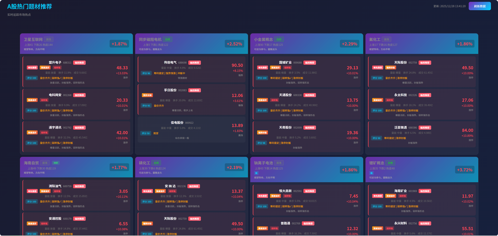

# A股热门题材推荐系统

实时追踪A股市场热点题材，智能分析并推荐优质股票，支持**历史报表存储**和**实盘收益跟踪**。

## 功能特性

### 核心功能
- **热门题材追踪** - 实时获取东方财富热门概念板块
- **情绪周期分析** - 判断题材所处阶段（启动/发酵/高潮/分歧/退潮）
- **题材质量评估** - 大新强标签量化（市场容量/新鲜度/政策支持）
- **消息面分析** - 多源新闻聚合（新浪财经/同花顺），智能匹配题材利好利空
- **股票强度分析**
  - 量价关系（基于换手率）
  - 前排强度（逆势上涨/板块领涨/涨速凌厉）
  - 弱转强识别（低开高走/回踩确认/分时反转）
  - 竞价强度（竞价涨停/高开强势）
- **买入信号标签** - 强烈推荐/可买入/观察

### 📦 数据存储（新增）
- **SQLite本地存储** - 自动保存每日推荐报表
- **历史报表查询** - 查看任意日期的推荐记录
- **推荐股票详情** - 包含题材、角色、评分、信号等完整信息

### 📈 收益跟踪（新增）
- **实盘收益计算** - 自动跟踪推荐股票的后续表现
- **多周期统计** - T+1、T+2、T+3、T+5 收益率
- **分类统计** - 按角色（龙头/中军/低吸）统计胜率和收益
- **智能过滤** - 自动排除一字涨停等买不到的股票，收益更真实
- **定时更新** - 每天15:30自动更新收益数据
- **手动更新** - 支持随时手动触发收益更新

## 技术栈

- Python 3.8+
- Flask（Web框架）
- SQLite（数据存储）
- AKShare（金融数据接口）
- Schedule（定时任务）
- 前端：原生HTML/CSS/JavaScript

## 安装

```bash
# 克隆项目
git clone https://github.com/your-username/ticai.git
cd ticai

# 安装依赖
pip install -r requirements.txt

# 运行
python main.py
```

访问 http://127.0.0.1:80 (Windows需管理员权限)

## 页面说明

| 页面 | 路径 | 说明 |
|------|------|------|
| 今日推荐 | `/` | 实时获取热门题材和推荐股票 |
| 历史报表 | `/history` | 查看历史推荐记录 |
| 收益统计 | `/performance` | 查看推荐股票的实盘收益 |

## API接口

### 题材数据
- `GET /api/themes` - 获取热门题材列表
- `GET /api/all` - 获取所有题材及推荐股票（自动保存报表）

### 报表查询
- `GET /api/reports` - 获取历史报表列表
- `GET /api/reports/<日期>` - 获取指定日期报表详情

### 收益跟踪
- `GET /api/performance/summary` - 获取收益统计摘要
- `GET /api/performance/today` - 获取今日收益报告
- `POST /api/performance/update` - 手动触发收益更新
- `GET /api/stock/<代码>/history` - 获取股票历史推荐记录

## 项目结构

```
├── main.py                # Flask应用入口
├── routes.py              # API路由
├── analyzer.py            # 股票分析模块（量价/强度/评分）
├── emotion_cycle.py       # 情绪周期分析
├── theme_fetcher.py       # 题材数据获取
├── theme_quality.py       # 题材质量评估（大新强）
├── news_fetcher.py        # 多源新闻聚合
├── database.py            # 📦 SQLite数据库模块（新增）
├── performance_tracker.py # 📈 收益跟踪模块（新增）
├── feishu_pusher.py       # 飞书推送
├── config.py              # 配置文件
├── templates/
│   ├── index.html         # 今日推荐页面
│   ├── history.html       # 📋 历史报表页面（新增）
│   └── performance.html   # 📈 收益统计页面（新增）
├── ticai.db               # 📦 SQLite数据库文件（自动生成）
└── requirements.txt
```

## 数据库表结构

### reports（报表表）
| 字段 | 类型 | 说明 |
|------|------|------|
| id | INTEGER | 主键 |
| report_date | DATE | 报表日期 |
| market_change | REAL | 大盘涨跌幅 |
| themes_count | INTEGER | 题材数量 |
| stocks_count | INTEGER | 股票数量 |

### recommended_stocks（推荐股票表）
| 字段 | 类型 | 说明 |
|------|------|------|
| id | INTEGER | 主键 |
| report_id | INTEGER | 关联报表 |
| theme_name | TEXT | 题材名称 |
| stock_code | TEXT | 股票代码 |
| stock_name | TEXT | 股票名称 |
| recommend_price | REAL | 推荐时价格 |
| score | INTEGER | 评分 |
| role | TEXT | 角色（龙头/中军/低吸） |
| open_change | REAL | 开盘涨幅 |
| is_buyable | INTEGER | 是否可买入（1=可买，0=买不到） |
| unbuyable_reason | TEXT | 买不到原因 |

**买不到判断规则：**
- 一字涨停：开盘涨幅 ≥ 9.5%
- 竞价涨停：开盘涨幅 ≥ 7% 且当前涨停
- 高开秒板：开盘涨幅 ≥ 5% 且当前涨停

### performance（收益跟踪表）
| 字段 | 类型 | 说明 |
|------|------|------|
| id | INTEGER | 主键 |
| stock_id | INTEGER | 关联股票 |
| track_date | DATE | 跟踪日期 |
| days_held | INTEGER | 持有天数 |
| current_price | REAL | 当前价格 |
| return_pct | REAL | 收益率 |

## 定时任务

| 任务 | 时间 | 说明 |
|------|------|------|
| 飞书推送 | 每天20:00 | 推送当日推荐到飞书 |
| 收益更新 | 每天15:30 | 更新推荐股票收益 |

## 截图



## 使用建议

1. **每日操作**：盘中刷新"今日推荐"查看最新推荐
2. **收益追踪**：收盘后（15:30之后）点击"更新收益"
3. **复盘分析**：定期查看"收益统计"优化选股策略

## 免责声明

本项目仅供学习交流，不构成任何投资建议。股市有风险，投资需谨慎。

## License

MIT

